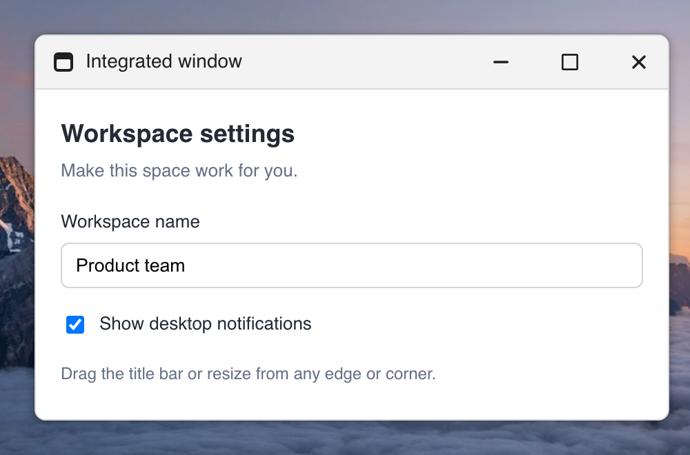
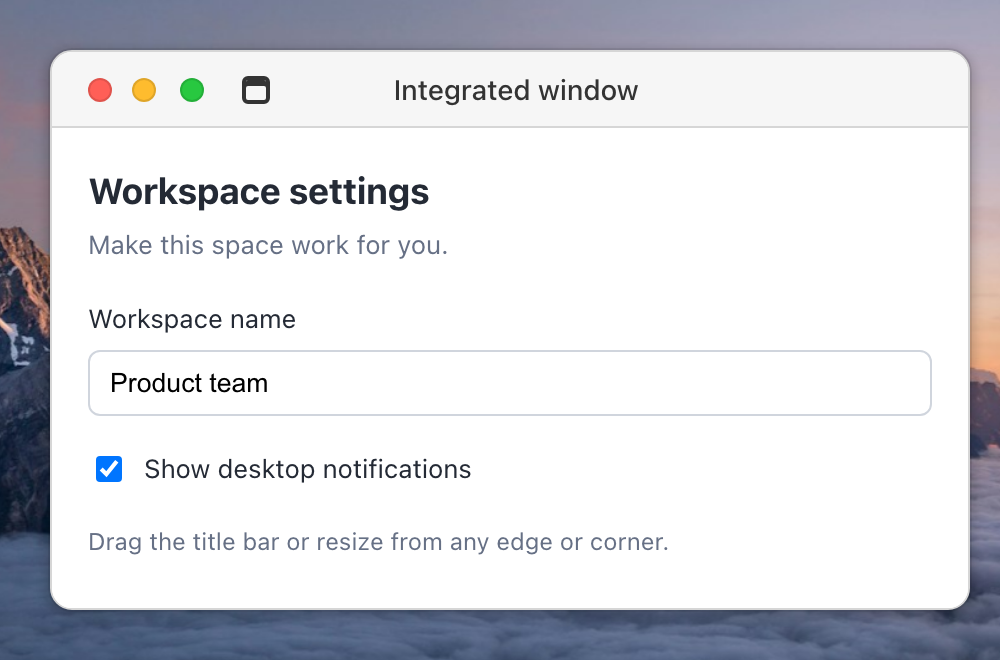

<p align="center">
  
</p>

# Floaty Widget

[](https://www.npmjs.com/package/floaty-widget)
[](https://www.npmjs.com/package/floaty-widget)
[](https://github.com/ElJijuna/floaty-widget/actions/workflows/ci.yml)
[](./LICENSE)

Draggable, collapsible, resizable floating widgets for React 18 and 19.

| Windows style | macOS style |
| --- | --- |
|  |  |

## Installation

```bash
npm install floaty-widget
```

The package is also mirrored to [GitHub Packages](https://github.com/ElJijuna/floaty-widget/pkgs/npm/floaty-widget) as `@eljijuna/floaty-widget`:

```bash
echo "@eljijuna:registry=https://npm.pkg.github.com" >> .npmrc
npm install @eljijuna/floaty-widget
```

GitHub Packages requires authentication even for public packages. Use a token with the `read:packages` scope.

## Usage modes

There are three ways to use Floaty, from simplest to most powerful.

---

### 1. Singleton — zero setup

Call `openFloaty` from anywhere. No Provider or Viewport needed — Floaty mounts its own root on the first call.

```tsx
import { openFloaty, closeFloaty } from 'floaty-widget';

function MyComponent({ userId }: { userId: string }) {
  return <div>User: {userId}</div>;
}

// Open a floating widget
openFloaty({
  id: 'user-panel',
  title: 'User Info',
  component: MyComponent,
  props: { userId: '123' },
});

// Close it
closeFloaty('user-panel');
```

Other singleton functions:

```ts
updateFloaty('user-panel', { collapsed: true });
closeAllFloaty();
```

---

### 2. Provider + hook — full control

Wrap your app with `FloatyProvider` and place `FloatyViewport` where widgets should render. Use `useFloaty()` to open widgets from any component.

```tsx
// main.tsx
import { FloatyProvider, FloatyViewport } from 'floaty-widget';

export function App() {
  return (
    <FloatyProvider>
      <Toolbar />
      <FloatyViewport />
    </FloatyProvider>
  );
}
```

```tsx
// Toolbar.tsx
import { useFloaty } from 'floaty-widget';
import { CommitsPanel } from './CommitsPanel';

function Toolbar() {
  const floaty = useFloaty();

  return (
    <button
      onClick={() =>
        floaty.open({
          id: 'commits',
          title: 'Commits',
          component: CommitsPanel,
          props: { repo: 'floaty-widget' },
        })
      }
    >
      Open commits
    </button>
  );
}
```

The manager exposes a full API:

```ts
floaty.open({ id, component, props, title, position, collapsed, pinned })
floaty.open({ id, loader: () => import('./HeavyPanel'), props })
floaty.close('commits')
floaty.closeAll()
floaty.update('commits', { collapsed: true, props: { repo: 'other' } })
floaty.updateProps('commits', { repo: 'other' })
floaty.bringToFront('commits')

// Bulk operations
floaty.collapseAll()
floaty.expandAll()
floaty.minimizeAll()
floaty.restoreAll()
floaty.pinAll()
floaty.unpinAll()
floaty.arrangeWindows('grid', { bottomInset: 72 })

// Per-widget
floaty.collapseWidget('commits')
floaty.minimizeWidget('commits')
floaty.pinWidget('commits')
```

---

### 3. Singleton + Provider together

If you already use `FloatyProvider` but also want `openFloaty` to work in the same widget tree, add `useFloatySingleton()` once inside the Provider. The singleton will use your Provider's manager instead of creating its own.

```tsx
import { FloatyProvider, FloatyViewport, useFloatySingleton } from 'floaty-widget';

function FloatyBridge() {
  useFloatySingleton(); // connects openFloaty() to this Provider
  return null;
}

export function App() {
  return (
    <FloatyProvider>
      <FloatyBridge />
      <MyApp />
      <FloatyViewport />
    </FloatyProvider>
  );
}
```

```tsx
// Now openFloaty opens widgets inside your FloatyViewport
import { openFloaty } from 'floaty-widget';

openFloaty({ id: 'panel', component: MyPanel, props: {} });
```

---

### 4. Standalone `<Floaty>` component

Drop a `<Floaty>` directly anywhere for a self-contained floating panel with no manager. Double-clicking the header toggles collapse. The resize handle is opt-in from the header resize button, keeping the widget clean until the user wants to resize it.

```tsx
import { Floaty } from 'floaty-widget';

function App() {
  return (
    <>
      <MyApp />
      <Floaty title="Debug" initialPosition={{ x: 100, y: 100 }}>
        <pre>{JSON.stringify(state, null, 2)}</pre>
      </Floaty>
    </>
  );
}
```

### Lazy widget content

Use `loader` when a widget contains heavy code that should not be included in
the initial app bundle. The import starts only when the widget is rendered.

```tsx
floaty.open({
  id: 'heavy-panel',
  title: 'Heavy panel',
  loader: () => import('./HeavyPanel'),
  props: { repo: 'floaty-widget' },
  fallback: <span>Loading...</span>, // optional — a spinner is shown by default
});
```

If the loader rejects, Floaty shows an error state with a **Retry** button that
re-triggers the loader. No extra setup needed.

The loaded module can export the component as `default`. You can also return a
component directly from the loader.

```tsx
floaty.open({
  id: 'named-panel',
  loader: () => import('./panels').then((module) => module.NamedPanel),
  props: {},
});
```

---

## Widget preview

`FloatyPreview` renders a scaled-down live thumbnail of any widget registered in a
`FloatyWidgetManager`. Use it to build dock bars, widget pickers, thumbnail grids,
or any UI that needs a miniaturized view of a widget's content.

```tsx
import { FloatyProvider, FloatyViewport, FloatyPreview } from 'floaty-widget';

<FloatyProvider>
  <App />
  <FloatyViewport />

  {/* Renders a 40%-scale thumbnail of the widget with id "my-widget" */}
  <FloatyPreview
    id="my-widget"
    scale={0.4}
    style={{ width: 200, height: 120, borderRadius: 8, overflow: 'hidden' }}
    fallback={<span>Widget not open</span>}
  />
</FloatyProvider>
```

The component mounts a **separate instance** of the widget's component — external
state (context, stores) is reflected live, but internal `useState` is independent
from the real widget. Clicks and keyboard events on the thumbnail are suppressed
(`pointerEvents: none`).

| Prop | Type | Default | Description |
| --- | --- | --- | --- |
| `id` | `string` | — | ID of the widget to preview |
| `scale` | `number` | `0.4` | Scale factor (e.g. `0.4` renders content at 40% of its natural size) |
| `fallback` | `ReactNode` | `null` | Rendered when the widget is not open or has no component |
| `className` | `string` | — | CSS class on the preview container |
| `style` | `CSSProperties` | — | Inline styles on the preview container (use this to set width/height) |

The preview container uses `overflow: hidden` automatically. Size it via `style`
so that `naturalWidth × scale` and `naturalHeight × scale` fit within the box.

---

## Floaty props

All props are optional.

| Prop | Type | Default | Description |
| --- | --- | --- | --- |
| `title` | `ReactNode` | `'Floaty'` | Header title |
| `children` | `ReactNode` | `'Content'` | Body content |
| `id` | `string` | — | Registers with `FloatyProvider` when provided |
| `mode` | `'floating' \| 'window'` | `'floating'` | Use `window` for an integrated, always-visible header |
| `windowStyle` | `'windows' \| 'mac' \| 'custom'` | `'windows'` | Window title bar appearance; `custom` uses your CSS variables |
| `windowIcon` | `ReactNode` | Built-in icon | Application icon in the window title bar |
| `initialPosition` | `{ x, y }` | `{ x: 100, y: 100 }` | Starting position — automatically clamped to viewport bounds |
| `initialSize` | `{ width?, height? }` | — | Starting size |
| `defaultCollapsed` | `boolean` | `false` | Start collapsed |
| `defaultMinimized` | `boolean` | `false` | Start hidden |
| `defaultPinned` | `boolean` | `false` | Start pinned (no drag) |
| `defaultMaximized` | `boolean` | `false` | Start maximized in the viewport |
| `sizeConstraints` | `{ minWidth?, minHeight?, maxWidth?, maxHeight? }` | — | Pixel resize constraints |
| `snap` | `boolean` | `true` | Enable edge and corner snap in window mode |
| `snapThreshold` | `number` | `28` | Distance in pixels that activates snap |
| `persistenceKey` | `string` | — | Persist geometry and window state in localStorage |
| `zIndex` | `number` | — | CSS z-index |
| `isActive` | `boolean` | `false` | Marks this widget as the front-most; reveals the header without requiring hover |
| `autoFocus` | `boolean` | `false` | Moves keyboard focus to the header when the widget appears (mount or restore) |
| `restoreFocus` | `boolean` | `true` | Returns focus to the previously focused element when the widget closes or minimizes with focus inside |
| `labels` | `Partial<FloatyTexts>` | — | Override button, resize, loading, and error labels |
| `icons` | `FloatyIcons` | — | Override button icons |
| `style` | `CSSProperties` | — | Root element styles |
| `className` | `string` | — | Root element class |
| `onClose` | `() => void` | — | Shows close button when provided |
| `onFocus` | `() => void` | — | Called on pointer down |
| `onFocusChange` | `(focused) => void` | — | Reports front-most focus changes |
| `onPositionChange` | `(position) => void` | — | Reports committed movement |
| `onResizeStart` / `onResize` / `onResizeEnd` | `(size) => void` | — | Interactive resize lifecycle |
| `onMaximizeChange` | `(maximized) => void` | — | Reports maximize/restore changes |

Use window mode when the controls should remain attached and visible like a desktop window:

```tsx
<Floaty
  mode="window"
  windowStyle="mac"
  title="Settings"
  persistenceKey="workspace:settings"
  sizeConstraints={{ minWidth: 320, minHeight: 180 }}
  onClose={closeSettings}
>
  <Settings />
</Floaty>
```

Window mode supports eight resize zones, maximize/restore, and snap to halves, quarters, or the
full viewport. The same window and persistence options are accepted by `openFloaty()` and
`manager.open()`.

### Arrange multiple windows

The manager can organize visible window-mode widgets in columns, rows, or a grid. Minimized
windows and floating widgets keep their current state. You can reserve space for a taskbar:

```tsx
const manager = useFloatyWidgetManager();

manager.arrangeWindows('grid', { gap: 12, margin: 16, bottomInset: 72 });
manager.arrangeWindows('columns');
manager.arrangeWindows('rows');
```

`arrangeWindows()` returns the number of windows arranged. It clears maximize and snap state,
expands collapsed windows, and persists the new geometry for windows with a `persistenceKey`.

### Desktop taskbar

`FloatyTaskbar` reads the nearest manager and provides accessible focus, restore, and close
controls for every managed widget:

```tsx
import { FloatyProvider, FloatyTaskbar, FloatyViewport } from 'floaty-widget';

<FloatyProvider>
  <App />
  <FloatyViewport />
  <FloatyTaskbar />
</FloatyProvider>
```

### Imperative ref

```tsx
import { useRef } from 'react';
import { Floaty, FloatyHandle } from 'floaty-widget';

const ref = useRef<FloatyHandle>(null);

<Floaty ref={ref}>content</Floaty>

ref.current.collapse()
ref.current.expand()
ref.current.toggle()
ref.current.minimize()
ref.current.restore()
ref.current.pin()
ref.current.unpin()
ref.current.maximize()
ref.current.unmaximize()
ref.current.toggleMaximized()
ref.current.snapTo('left')
```

### Keyboard and viewport behavior

Floaty can be operated without a pointer:

- In floating mode, focus the header and press `Enter` or `Space` to collapse/expand.
- In window mode, `Enter`, `Space`, or a header double-click maximizes/restores the window.
- Focus the header and use arrow keys to move the widget. Hold `Shift` for larger steps or `Alt` for 1px steps.
- In floating mode, press the resize button in the header to reveal the resize handle; window mode keeps edge handles available.
- Focus the resize handle and use arrow keys to resize. Hold `Shift` for larger steps or `Alt` for 1px steps. In window mode the bottom-right handle is always in the tab order and only becomes visible on keyboard focus; edges and corners can also be dragged. Each key press emits `onResizeStart` and `onResizeEnd`.
- Drag a window header to a viewport edge or corner to preview and apply snap geometry.
- With `autoFocus`, focus moves to the widget header when it opens or is restored. When a widget closes or minimizes while focus is inside it, focus returns to the element that was focused before it appeared (disable with `restoreFocus={false}`). Focus that already moved elsewhere is never taken. Both options are also accepted by `openFloaty()` and `manager.open()`.

Widget positions are clamped into the visible viewport on initial render, during drag, and after viewport resize/orientation changes.

---

## Duplicate strategy

Control what happens when `open` is called with an existing id:

```ts
// Default: replace the widget
floaty.open({ id: 'panel', ... })

// Focus the existing one (restores if minimized)
floaty.open({ id: 'panel', ... }, { duplicateStrategy: 'focus' })

// Create a second instance with a unique id (panel-2, panel-3, ...)
floaty.open({ id: 'panel', ... }, { duplicateStrategy: 'duplicate' })
```

---

## Theming

Pass a `theme` object to `FloatyProvider` (or `FloatyWidgetManager`) to customize colors, spacing, and radius:

```tsx
<FloatyProvider
  theme={{
    background: '#1e1e2e',
    foreground: '#cdd6f4',
    headerBackground: '#181825',
    headerForeground: '#cdd6f4',
    pinnedHeaderBackground: '#89b4fa',
    pinnedHeaderForeground: '#1e1e2e',
    border: '#313244',
    radius: '8px',
    shadow: '0 4px 24px rgba(0,0,0,0.4)',
  }}
>
  <FloatyViewport />
</FloatyProvider>
```

Or use CSS variables directly:

```css
:root {
  --floaty-bg: #1e1e2e;
  --floaty-fg: #cdd6f4;
  --floaty-header-bg: #181825;
  --floaty-header-fg: #cdd6f4;
  --floaty-pinned-header-bg: #89b4fa;
  --floaty-pinned-header-fg: #1e1e2e;
  --floaty-body-bg: #1e1e2e;
  --floaty-border: #313244;
  --floaty-pinned-border: #89b4fa;
  --floaty-radius: 8px;
  --floaty-shadow: 0 4px 24px rgba(0, 0, 0, 0.4);
  --floaty-scrollbar-thumb: rgba(205, 214, 244, 0.34);
  --floaty-scrollbar-thumb-hover: rgba(205, 214, 244, 0.52);
  --floaty-scrollbar-track: rgba(30, 30, 46, 0.62);
  --floaty-drag-blur: 0.6px;
  --floaty-drag-opacity: 0.95;
  --floaty-font-family: inherit;
  --floaty-header-padding-block: 8px;
  --floaty-header-padding-inline: 12px;
  --floaty-body-padding: 12px;
  --floaty-button-radius: 4px;
  --floaty-button-hover-bg: rgba(255, 255, 255, 0.1);
}
```

When widget content overflows, `.floaty-body` uses a themed thin native scrollbar. Override `--floaty-scrollbar-thumb`, `--floaty-scrollbar-thumb-hover`, or `--floaty-scrollbar-track` to tune that overflow treatment.

### Custom icons

```tsx
import { Pin, PinFilled } from './icons';

<FloatyProvider
  icons={{
    pin: Pin,
    unpin: PinFilled,
    collapse: ChevronUp,
    expand: ChevronDown,
    minimize: Minus,
    resize: Maximize,
    close: X,
  }}
>
  <FloatyViewport />
</FloatyProvider>
```

### Custom labels

```tsx
<FloatyProvider
  labels={{
    pin: 'Fijar',
    unpin: 'Desfijar',
    collapse: 'Colapsar',
    expand: 'Expandir',
    minimize: 'Minimizar',
    restore: 'Restaurar',
    close: 'Cerrar',
    resize: 'Cambiar tamano',
    loading: 'Cargando panel...',
    loadError: 'No se pudo cargar el panel',
    retry: 'Reintentar',
  }}
>
  <FloatyViewport />
</FloatyProvider>
```

---

## Development

```bash
npm install
npm run dev          # dev server
npm run storybook    # component stories at localhost:6006
npm test             # run tests
npm run test:e2e     # run Playwright E2E tests against Storybook
npm run test:e2e:ui  # open Playwright's interactive test runner
npm run bench        # benchmarks
npm run build        # build library
```

Install the E2E browser once on a new machine with `npx playwright install chromium`.

## Releases

This project uses [Semantic Release](https://semantic-release.gitbook.io) with [Conventional Commits](https://www.conventionalcommits.org). Push to `main` to trigger an automatic release:

| Commit prefix | Version bump |
| --- | --- |
| `fix: ...` | patch — `0.1.0 → 0.1.1` |
| `feat: ...` | minor — `0.1.0 → 0.2.0` |
| `feat!: ...` or `fix!: ...` | major — `0.1.0 → 1.0.0` |

## License

MIT © [ElJijuna](https://github.com/ElJijuna)
