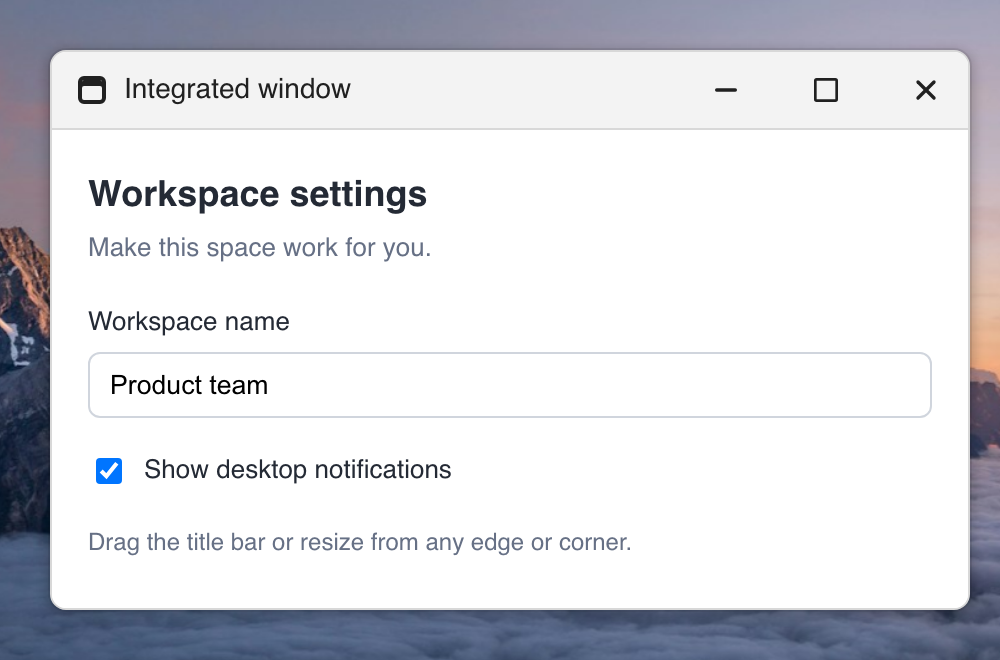
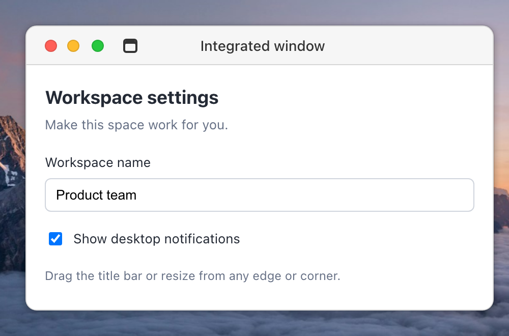

<p align="center">
  
</p>

# Floaty Widget

[](https://www.npmjs.com/package/floaty-widget)
[](https://www.npmjs.com/package/floaty-widget)
[](https://github.com/ElJijuna/floaty-widget/actions/workflows/ci.yml)
[](./LICENSE)

Draggable, collapsible, resizable floating widgets for React 18 and 19.

| Windows style | macOS style |
| --- | --- |
|  |  |

## Installation

```bash
npm install floaty-widget
```

The package is also mirrored to [GitHub Packages](https://github.com/ElJijuna/floaty-widget/pkgs/npm/floaty-widget) as `@eljijuna/floaty-widget`:

```bash
echo "@eljijuna:registry=https://npm.pkg.github.com" >> .npmrc
npm install @eljijuna/floaty-widget
```

GitHub Packages requires authentication even for public packages. Use a token with the `read:packages` scope.

## Usage modes

There are three ways to use Floaty, from simplest to most powerful.

---

### 1. Singleton — zero setup

Call `openFloaty` from anywhere. No Provider or Viewport needed — Floaty mounts its own root on the first call.

```tsx
import { openFloaty, closeFloaty } from 'floaty-widget';

function MyComponent({ userId }: { userId: string }) {
  return <div>User: {userId}</div>;
}

// Open a floating widget
openFloaty({
  id: 'user-panel',
  title: 'User Info',
  component: MyComponent,
  props: { userId: '123' },
});

// Close it
closeFloaty('user-panel');
```

Other singleton functions:

```ts
updateFloaty('user-panel', { collapsed: true });
closeAllFloaty();
```

---

### 2. Provider + hook — full control

Wrap your app with `FloatyProvider` and place `FloatyViewport` where widgets should render. Use `useFloaty()` to open widgets from any component.

```tsx
// main.tsx
import { FloatyProvider, FloatyViewport } from 'floaty-widget';

export function App() {
  return (
    <FloatyProvider>
      <Toolbar />
      <FloatyViewport />
    </FloatyProvider>
  );
}
```

```tsx
// Toolbar.tsx
import { useFloaty } from 'floaty-widget';
import { CommitsPanel } from './CommitsPanel';

function Toolbar() {
  const floaty = useFloaty();

  return (
    <button
      onClick={() =>
        floaty.open({
          id: 'commits',
          title: 'Commits',
          component: CommitsPanel,
          props: { repo: 'floaty-widget' },
        })
      }
    >
      Open commits
    </button>
  );
}
```

The manager exposes a full API:

```ts
floaty.open({ id, component, props, title, position, collapsed, pinned })
floaty.open({ id, loader: () => import('./HeavyPanel'), props })
floaty.close('commits')
floaty.closeAll()
floaty.update('commits', { collapsed: true, props: { repo: 'other' } })
floaty.updateProps('commits', { repo: 'other' })
floaty.bringToFront('commits')

// Bulk operations
floaty.collapseAll()
floaty.expandAll()
floaty.minimizeAll()
floaty.restoreAll()
floaty.pinAll()
floaty.unpinAll()
floaty.arrangeWindows('grid', { insets: { bottom: 72 } })

// Per-widget
floaty.collapseWidget('commits')
floaty.minimizeWidget('commits')
floaty.pinWidget('commits')
```

---

### 3. Singleton + Provider together

If you already use `FloatyProvider` but also want `openFloaty` to work in the same widget tree, add `useFloatySingleton()` once inside the Provider. The singleton will use your Provider's manager instead of creating its own.

```tsx
import { FloatyProvider, FloatyViewport, useFloatySingleton } from 'floaty-widget';

function FloatyBridge() {
  useFloatySingleton(); // connects openFloaty() to this Provider
  return null;
}

export function App() {
  return (
    <FloatyProvider>
      <FloatyBridge />
      <MyApp />
      <FloatyViewport />
    </FloatyProvider>
  );
}
```

```tsx
// Now openFloaty opens widgets inside your FloatyViewport
import { openFloaty } from 'floaty-widget';

openFloaty({ id: 'panel', component: MyPanel, props: {} });
```

---

### 4. Standalone `<Floaty>` component

Drop a `<Floaty>` directly anywhere for a self-contained floating panel with no manager. Double-clicking the header toggles collapse. At rest only the content shows; moving the pointer to its top edge reveals a frame with the controls, and every edge and corner resizes it, as in window mode.

```tsx
import { Floaty } from 'floaty-widget';

function App() {
  return (
    <>
      <MyApp />
      <Floaty title="Debug" initialPosition={{ x: 100, y: 100 }}>
        <pre>{JSON.stringify(state, null, 2)}</pre>
      </Floaty>
    </>
  );
}
```

### Lazy widget content

Use `loader` when a widget contains heavy code that should not be included in
the initial app bundle. The import starts only when the widget is rendered.

```tsx
floaty.open({
  id: 'heavy-panel',
  title: 'Heavy panel',
  loader: () => import('./HeavyPanel'),
  props: { repo: 'floaty-widget' },
  fallback: <span>Loading...</span>, // optional — a spinner is shown by default
});
```

If the loader rejects, Floaty shows an error state with a **Retry** button that
re-triggers the loader. No extra setup needed.

The loaded module can export the component as `default`. You can also return a
component directly from the loader.

```tsx
floaty.open({
  id: 'named-panel',
  loader: () => import('./panels').then((module) => module.NamedPanel),
  props: {},
});
```

---

## Widget preview

`FloatyPreview` renders a scaled-down live thumbnail of any widget registered in a
`FloatyWidgetManager`. Use it to build dock bars, widget pickers, thumbnail grids,
or any UI that needs a miniaturized view of a widget's content.

```tsx
import { FloatyProvider, FloatyViewport, FloatyPreview } from 'floaty-widget';

<FloatyProvider>
  <App />
  <FloatyViewport />

  {/* Renders a 40%-scale thumbnail of the widget with id "my-widget" */}
  <FloatyPreview
    id="my-widget"
    scale={0.4}
    style={{ width: 200, height: 120, borderRadius: 8, overflow: 'hidden' }}
    fallback={<span>Widget not open</span>}
  />
</FloatyProvider>
```

The component mounts a **separate instance** of the widget's component — external
state (context, stores) is reflected live, but internal `useState` is independent
from the real widget. Clicks and keyboard events on the thumbnail are suppressed
(`pointerEvents: none`).

| Prop | Type | Default | Description |
| --- | --- | --- | --- |
| `id` | `string` | — | ID of the widget to preview |
| `scale` | `number` | `0.4` | Scale factor (e.g. `0.4` renders content at 40% of its natural size) |
| `fallback` | `ReactNode` | `null` | Rendered when the widget is not open or has no component |
| `className` | `string` | — | CSS class on the preview container |
| `style` | `CSSProperties` | — | Inline styles on the preview container (use this to set width/height) |

The preview container uses `overflow: hidden` automatically. Size it via `style`
so that `naturalWidth × scale` and `naturalHeight × scale` fit within the box.

---

## Floaty props

All props are optional.

| Prop | Type | Default | Description |
| --- | --- | --- | --- |
| `title` | `ReactNode` | `'Floaty'` | Header title |
| `children` | `ReactNode` | `'Content'` | Body content |
| `id` | `string` | — | Registers with `FloatyProvider` when provided |
| `mode` | `'floating' \| 'window'` | `'floating'` | Use `window` for an integrated, always-visible header |
| `windowStyle` | `'windows' \| 'mac' \| 'custom'` | `'windows'` | Window title bar appearance; `custom` uses your CSS variables |
| `windowIcon` | `ReactNode` | Built-in icon | Application icon in the window title bar |
| `initialPosition` | `{ x, y }` | `{ x: 100, y: 100 }` | Starting position — automatically clamped to viewport bounds |
| `initialSize` | `{ width?, height? }` | — | Starting size |
| `defaultCollapsed` | `boolean` | `false` | Start collapsed |
| `defaultMinimized` | `boolean` | `false` | Start hidden |
| `defaultPinned` | `boolean` | `false` | Start pinned (no drag) |
| `defaultMaximized` | `boolean` | `false` | Start maximized in the viewport |
| `sizeConstraints` | `{ minWidth?, minHeight?, maxWidth?, maxHeight? }` | — | Pixel resize constraints |
| `snap` | `boolean` | `true` | Enable edge and corner snap in window mode |
| `snapThreshold` | `number` | `28` | Distance in pixels that activates snap |
| `persistenceKey` | `string` | — | Persist geometry and window state in localStorage |
| `zIndex` | `number` | — | CSS z-index |
| `isActive` | `boolean` | `false` | Marks this widget as the front-most; reveals the header without requiring hover |
| `autoFocus` | `boolean` | `false` | Moves keyboard focus to the header when the widget appears (mount or restore) |
| `restoreFocus` | `boolean` | `true` | Returns focus to the previously focused element when the widget closes or minimizes with focus inside |
| `labels` | `Partial<FloatyTexts>` | — | Override button, resize, loading, and error labels |
| `icons` | `FloatyIcons` | — | Override button icons |
| `style` | `CSSProperties` | — | Root element styles |
| `className` | `string` | — | Root element class |
| `onClose` | `() => void` | — | Shows close button when provided |
| `onFocus` | `() => void` | — | Called on pointer down |
| `onFocusChange` | `(focused) => void` | — | Reports front-most focus changes |
| `onPositionChange` | `(position) => void` | — | Reports committed movement |
| `onResizeStart` / `onResize` / `onResizeEnd` | `(size) => void` | — | Interactive resize lifecycle |
| `onMaximizeChange` | `(maximized) => void` | — | Reports maximize/restore changes |

Use window mode when the controls should remain attached and visible like a desktop window:

```tsx
<Floaty
  mode="window"
  windowStyle="mac"
  title="Settings"
  persistenceKey="workspace:settings"
  sizeConstraints={{ minWidth: 320, minHeight: 180 }}
  onClose={closeSettings}
>
  <Settings />
</Floaty>
```

Window mode supports eight resize zones, maximize/restore, and snap to halves, quarters, or the
full viewport. The same window and persistence options are accepted by `openFloaty()` and
`manager.open()`.

### Arrange multiple windows

The manager can organize visible window-mode widgets in columns, rows, a grid, or docked
against one edge of the viewport. Minimized windows and floating widgets keep their current
state. You can reserve space for a header, sidebar or taskbar:

```tsx
const manager = useFloatyWidgetManager();

manager.arrangeWindows('grid', { gap: 12, margin: 16, insets: { bottom: 72 } });
manager.arrangeWindows('columns');
manager.arrangeWindows('rows');

// Dock every window against an edge
manager.arrangeWindows('left'); // stacked one below the other on the left
manager.arrangeWindows('right', { size: 360 }); // stacked on the right, 360px wide
manager.arrangeWindows('top'); // side by side along the top
manager.arrangeWindows('bottom', { size: 220, insets: { bottom: 72 } }); // side by side above the taskbar
```

Use `insets` to keep windows clear of fixed UI such as an app header, a sidebar or a taskbar.
Each inset is added to `margin` on its edge. The older `bottomInset` option still works but is
deprecated in favour of `insets.bottom`, which takes precedence when both are set:

```tsx
manager.arrangeWindows('left', { insets: { top: 64, left: 240, bottom: 72 } });
```

For `left`/`right`, `size` is the stack width; for `top`/`bottom`, it is the stack height. When
omitted, it defaults to the largest current width (or height) among the arranged windows. If the
windows do not fit along the edge at their minimum size, they wrap into additional lanes inward.

`arrangeWindows()` returns the number of windows arranged. It clears maximize and snap state,
expands collapsed windows, and persists the new geometry for windows with a `persistenceKey`.

Windows slide and resize into place. Tune the transition with the `--floaty-arrange-duration` and
`--floaty-arrange-easing` CSS variables, or pass `animate: false` to jump instantly. The animation
is skipped when the user prefers reduced motion. The same transition is available on a single
window through its handle: `ref.current.setGeometry(geometry, { animate: true })`.

#### Keep a layout active

`arrangeWindows()` is a one-shot action: windows opened, closed or restored afterwards keep their
own geometry. Use `setLayout()` to keep an arrangement active instead. It is applied immediately
and re-applied whenever window-mode widgets are opened, closed, minimized, restored, maximized or
unmaximized, and when the viewport resizes:

```tsx
manager.setLayout('right', { size: 360, insets: { bottom: 72 } });

manager.layout; // { arrangement: 'right', options: { size: 360, insets: { bottom: 72 } } }

manager.setLayout(null); // release windows back to free positioning
```

Maximized windows temporarily leave the layout and rejoin it when unmaximized. Reflows caused
by a viewport resize are applied without animation so windows follow the resize immediately. For docked
layouts without an explicit `size`, the thickness is taken from the current windows the first time
the layout is applied and then kept, so opening a larger window does not resize the whole stack.
Manually dragging or resizing a window does not release the layout; that window is put back in
place on the next reflow.

#### Resize windows together

While `setLayout()` keeps a layout, `FloatyViewport` draws a divider in each gap between
neighbouring windows, and on the inner edge of a dock. Dragging one resizes the windows on both
sides at once; neither goes below its minimum size. Dividers are focusable separators: the arrow
keys move them (<kbd>Shift</kbd> for larger steps) and a double-click evens the split again.

The split is stored as weights, which you can also set yourself:

```tsx
manager.setLayout('columns', { columnWeights: [2, 1, 1] }); // first column twice as wide
manager.setLayout('right', { size: 420, rowWeights: [1, 3] }); // bottom window three times taller
manager.setLayout('grid', { resizable: false }); // no dividers
```

- `columnWeights` sizes grid/columns/rows columns and the windows of a `top`/`bottom` dock.
- `rowWeights` sizes grid/columns/rows rows and the windows of a `left`/`right` dock.
- Dragging a dock's inner edge updates `size`. Docks that wrap into several lanes only expose
  that edge.
- Weights are kept when windows open or close; new tracks take the average weight. Calling
  `setLayout()` again replaces them with the options you pass.
- `manager.layout.options` always reflects the current split, so you can persist it yourself.
- Set `labels.layoutDivider` to translate the dividers' accessible name.

### Tabbed windows

Window-mode widgets can be merged into one tabbed window, like browser tabs. Enable
drag-and-drop with `windowGrouping`: drop a window on another window's title bar to merge them
(the target is outlined while you drag), and drag a tab out of the strip to detach it again.

```tsx
<FloatyProvider windowGrouping>
  <App />
  <FloatyViewport />
</FloatyProvider>
```

The same operations are available programmatically, with or without `windowGrouping`:

```tsx
const manager = useFloatyWidgetManager();

manager.groupWindows(['notes', 'chat']); // 'notes' keeps its place, 'chat' joins as the active tab
manager.setActiveTab('notes');
manager.ungroupWindow('chat', { x: 400, y: 120 }); // standalone window again
manager.getGroup('notes'); // { id, widgetIds: ['notes'], activeId } or undefined
manager.groups; // Map of every group
```

Inactive tabs stay mounted but hidden, so their content keeps its state (form input, scroll,
component state) when you switch tabs, merge or detach. Behaviour worth knowing:

- The first id passed to `groupWindows()` is the target: its window keeps its geometry and its
  existing group. Other ids join with every member of their own groups.
- Closing the visible tab hands the window to its neighbour; a group left with one tab dissolves.
- Minimize, maximize, snap, `arrangeWindows()` and `setLayout()` treat a group as one window.
  `restoreWidget()` and `bringToFront()` on any member show that member's tab.
- Tab keyboard support: <kbd>←</kbd>/<kbd>→</kbd>/<kbd>Home</kbd>/<kbd>End</kbd> switch tabs,
  <kbd>Delete</kbd> closes the focused tab and <kbd>Alt</kbd>+<kbd>↓</kbd> detaches it.
- Groups are not persisted; each widget's own `persistenceKey` still stores its geometry.
- Set `labels.tabs` to translate the tab strip's accessible name, and `--floaty-merge-color` to
  change the drop highlight.

### Desktop taskbar

`FloatyTaskbar` reads the nearest manager and provides accessible focus, restore, and close
controls for every managed widget:

```tsx
import { FloatyProvider, FloatyTaskbar, FloatyViewport } from 'floaty-widget';

<FloatyProvider>
  <App />
  <FloatyViewport />
  <FloatyTaskbar />
</FloatyProvider>
```

### Imperative ref

```tsx
import { useRef } from 'react';
import { Floaty, FloatyHandle } from 'floaty-widget';

const ref = useRef<FloatyHandle>(null);

<Floaty ref={ref}>content</Floaty>

ref.current.collapse()
ref.current.expand()
ref.current.toggle()
ref.current.minimize()
ref.current.restore()
ref.current.pin()
ref.current.unpin()
ref.current.maximize()
ref.current.unmaximize()
ref.current.toggleMaximized()
ref.current.snapTo('left')
```

### Keyboard and viewport behavior

Floaty can be operated without a pointer:

- In floating mode, focus the header and press `Enter` or `Space` to collapse/expand.
- In window mode, `Enter`, `Space`, or a header double-click maximizes/restores the window.
- Focus the header and use arrow keys to move the widget. Hold `Shift` for larger steps or `Alt` for 1px steps.
- Both modes resize from any edge or corner; Tab to the resize handle and use the arrow keys to resize from the keyboard.
- Focus the resize handle and use arrow keys to resize. Hold `Shift` for larger steps or `Alt` for 1px steps. In window mode the bottom-right handle is always in the tab order and only becomes visible on keyboard focus; edges and corners can also be dragged. Each key press emits `onResizeStart` and `onResizeEnd`.
- Drag a window header to a viewport edge or corner to preview and apply snap geometry.
- With `autoFocus`, focus moves to the widget header when it opens or is restored. When a widget closes or minimizes while focus is inside it, focus returns to the element that was focused before it appeared (disable with `restoreFocus={false}`). Focus that already moved elsewhere is never taken. Both options are also accepted by `openFloaty()` and `manager.open()`.

Widget positions are clamped into the visible viewport on initial render, during drag, and after viewport resize/orientation changes.

---

## Duplicate strategy

Control what happens when `open` is called with an existing id:

```ts
// Default: replace the widget
floaty.open({ id: 'panel', ... })

// Focus the existing one (restores if minimized)
floaty.open({ id: 'panel', ... }, { duplicateStrategy: 'focus' })

// Create a second instance with a unique id (panel-2, panel-3, ...)
floaty.open({ id: 'panel', ... }, { duplicateStrategy: 'duplicate' })
```

---

## Theming

Pass a `theme` object to `FloatyProvider` (or `FloatyWidgetManager`) to customize colors, spacing, and radius:

```tsx
<FloatyProvider
  theme={{
    background: '#1e1e2e',
    foreground: '#cdd6f4',
    headerBackground: '#181825',
    headerForeground: '#cdd6f4',
    pinnedHeaderBackground: '#89b4fa',
    pinnedHeaderForeground: '#1e1e2e',
    border: '#313244',
    radius: '8px',
    shadow: '0 4px 24px rgba(0,0,0,0.4)',
  }}
>
  <FloatyViewport />
</FloatyProvider>
```

Or use CSS variables directly:

```css
:root {
  --floaty-bg: #1e1e2e;
  --floaty-fg: #cdd6f4;
  --floaty-header-bg: #181825;
  --floaty-header-fg: #cdd6f4;
  --floaty-pinned-header-bg: #89b4fa;
  --floaty-pinned-header-fg: #1e1e2e;
  --floaty-body-bg: #1e1e2e;
  --floaty-border: #313244;
  --floaty-pinned-border: #89b4fa;
  --floaty-radius: 8px;
  --floaty-shadow: 0 4px 24px rgba(0, 0, 0, 0.4);
  --floaty-scrollbar-thumb: rgba(205, 214, 244, 0.34);
  --floaty-scrollbar-thumb-hover: rgba(205, 214, 244, 0.52);
  --floaty-scrollbar-track: rgba(30, 30, 46, 0.62);
  --floaty-drag-blur: 0.6px;
  --floaty-drag-opacity: 0.95;
  --floaty-arrange-duration: 0.24s;
  --floaty-arrange-easing: cubic-bezier(0.2, 0, 0, 1);
  --floaty-font-family: inherit;
  --floaty-header-padding-block: 8px;
  --floaty-header-padding-inline: 12px;
  --floaty-body-padding: 12px;
  --floaty-button-radius: 4px;
  --floaty-button-hover-bg: rgba(255, 255, 255, 0.1);
}
```

When widget content overflows, `.floaty-body` uses a themed thin native scrollbar. Override `--floaty-scrollbar-thumb`, `--floaty-scrollbar-thumb-hover`, or `--floaty-scrollbar-track` to tune that overflow treatment.

### Custom icons

```tsx
import { Pin, PinFilled } from './icons';

<FloatyProvider
  icons={{
    pin: Pin,
    unpin: PinFilled,
    collapse: ChevronUp,
    expand: ChevronDown,
    minimize: Minus,
    resize: Maximize,
    close: X,
  }}
>
  <FloatyViewport />
</FloatyProvider>
```

### Custom labels

```tsx
<FloatyProvider
  labels={{
    pin: 'Fijar',
    unpin: 'Desfijar',
    collapse: 'Colapsar',
    expand: 'Expandir',
    minimize: 'Minimizar',
    restore: 'Restaurar',
    close: 'Cerrar',
    resize: 'Cambiar tamano',
    loading: 'Cargando panel...',
    loadError: 'No se pudo cargar el panel',
    retry: 'Reintentar',
    tabs: 'Pestañas',
    layoutDivider: 'Redimensionar ventanas',
  }}
>
  <FloatyViewport />
</FloatyProvider>
```

---

## Development

```bash
npm install
npm run dev          # dev server
npm run storybook    # component stories at localhost:6006
npm test             # run tests
npm run test:e2e     # run Playwright E2E tests against Storybook
npm run test:e2e:ui  # open Playwright's interactive test runner
npm run bench        # benchmarks
npm run build        # build library
```

Install the E2E browser once on a new machine with `npx playwright install chromium`.

## Releases

This project uses [Semantic Release](https://semantic-release.gitbook.io) with [Conventional Commits](https://www.conventionalcommits.org). Push to `main` to trigger an automatic release:

| Commit prefix | Version bump |
| --- | --- |
| `fix: ...` | patch — `0.1.0 → 0.1.1` |
| `feat: ...` | minor — `0.1.0 → 0.2.0` |
| `feat!: ...` or `fix!: ...` | major — `0.1.0 → 1.0.0` |

## License

MIT © [ElJijuna](https://github.com/ElJijuna)
